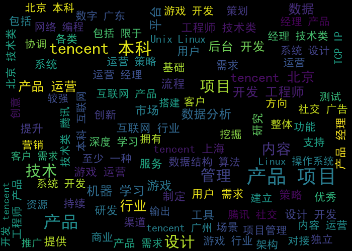

# tencent-jobs-wordcloud
腾讯社招岗位词云提取

1.scrapy爬虫，获取全部的job信息，写入文件.

   a.运行方式cd tencentjob/spiders;  scrapy crawl tencent;

   b.配置文件路径:FEED_URI="/tmp/tencentjob.csv"

## wordCloud_gen.py
2.用jieba分词做一些分词、停用词过滤
3.用WordCloud直观展示词云 

 
 2018.5.19更新
 
## keywords_extra.py
4. 直接使用jieba，在Textrank算法下提取的关键词列表，输出到textrank-${date}
 
 
